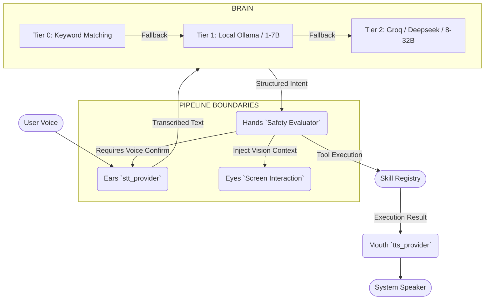

# VoxAgent Architecture Diagram

VoxAgent is designed around a strictly unidirectional tiered execution pipeline enforcing Solid principles, ensuring modularity and secure context separation.

## High-Level Pipeline

## Core Modules

- **Agent (`app.py`)**: The `VoxAgentApp` coordinates module lifecycle, graceful shutdowns via SIGINT, and the global background `Autopilot` thread instance.
- **Brain (`brain.py`)**: Routes intents intelligently based on cost constraints and required capability. Uses a strict JSON tool schema and intercepts implicit vision intent routing to the **Eyes**.
- **SyncManager (`sync.py`)**: Handles non-blocking persistent JSON local and intra-network syncs. Safe multi-device operations driven asynchronously (`asyncio.to_thread`).
- **Hands (`hands.py`)**: Responsible for execution layer validation. It rejects potentially dangerous system-level activities without dual-validation from input sources.

## Security Constraints

The current iteration (v0.1.0) blocks system calls via:
1. `terminal.py` whitelist limits string chains. No `shell=True` configurations.
2. API interactions are bounded statically, enforcing rate-limits at a 10k cache lock. Timing-safe verifications block remote bypasses.
